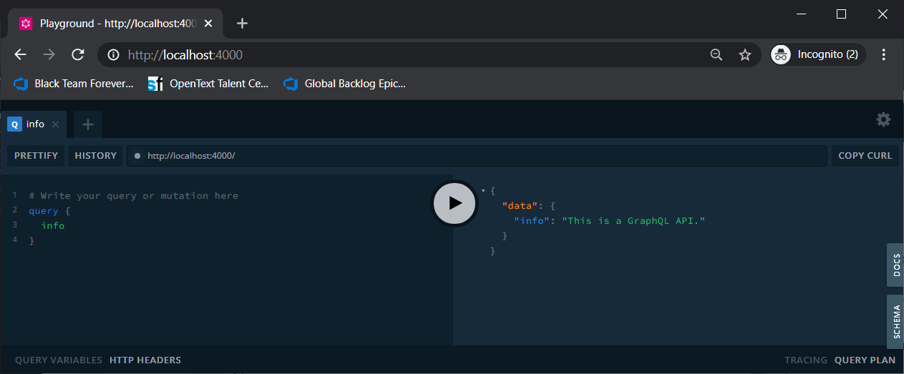

SimpleGraphQlApi
================

This repository implements a rudimentary GraphQL API.

Running
-------

To run the API, run the script "Source/Create_GraphQL_API.bat" from within the directory that holds it, then start a web browser and navigate to "http://localhost:4000".